# HealTracker for MacroQuest

HealTracker is a powerful all-in-one healing, DPS, tanking, history, and burn timer analysis tool designed specifically for EverQuest players using MacroQuest.

Originally created to provide real-time raid and group analytics similar to GamParse while remaining fully integrated inside EverQuest, HealTracker offers live overlays, historical analysis, encounter comparisons, burn tracking, death analysis, spell usage breakdowns, and much more.

Created by **Dorfus**.

---

# Features

## Real-Time DPS Tracking

HealTracker continuously parses combat and displays live raid/group damage in real time.

### Features

- Raid DPS
- Personal DPS
- Total damage
- Damage type breakdowns
- Spell vs Melee damage
- DPS over time graph
- Top spell tracking
- Death tracking
- Spike damage detection
- Tank damage tracking

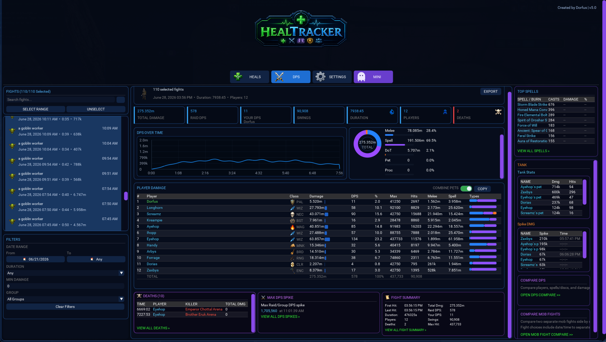

---

## Healing Analysis

The Healing tab provides complete healing analysis for every encounter.

Track:

- Total healing
- HPS
- Average heal amount
- Maximum heal
- Direct heals
- HoTs
- Rune healing
- Proc healing
- Shield healing
- Top healers
- Most healed players
- Healing by spell

Hover over graphs to inspect healing values at any point during the encounter.

---

## Healing Details

Click any player in the **Healed For** section to instantly see exactly who healed them.

This makes it easy to determine:

- Primary healers
- Backup healers
- Tank healer assignments
- Cross-healing activity

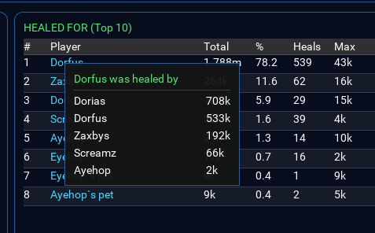

---

# Historical Encounter Database

Every fight is automatically saved and can later be searched, filtered, and analyzed.

Filter by:

- Date ranges
- Encounter duration
- Minimum damage
- Group or raid

Features:

- Search encounters
- Select multiple encounters
- Combine fights together
- Compare encounters
- Export results

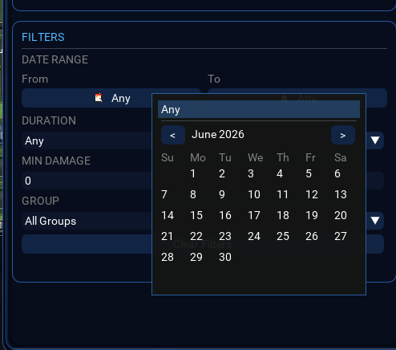

---

# Encounter Comparison

HealTracker allows comparing two separate boss kills side-by-side.

Useful for:

- Raid progression
- Strategy analysis
- Burn comparisons
- Attendance comparisons
- Performance reviews

Fight selections include timestamps so identical boss names can still be distinguished.

### Features

- Compare Raid DPS
- Compare player performance
- Compare spell usage
- Compare encounter duration
- Compare raid composition

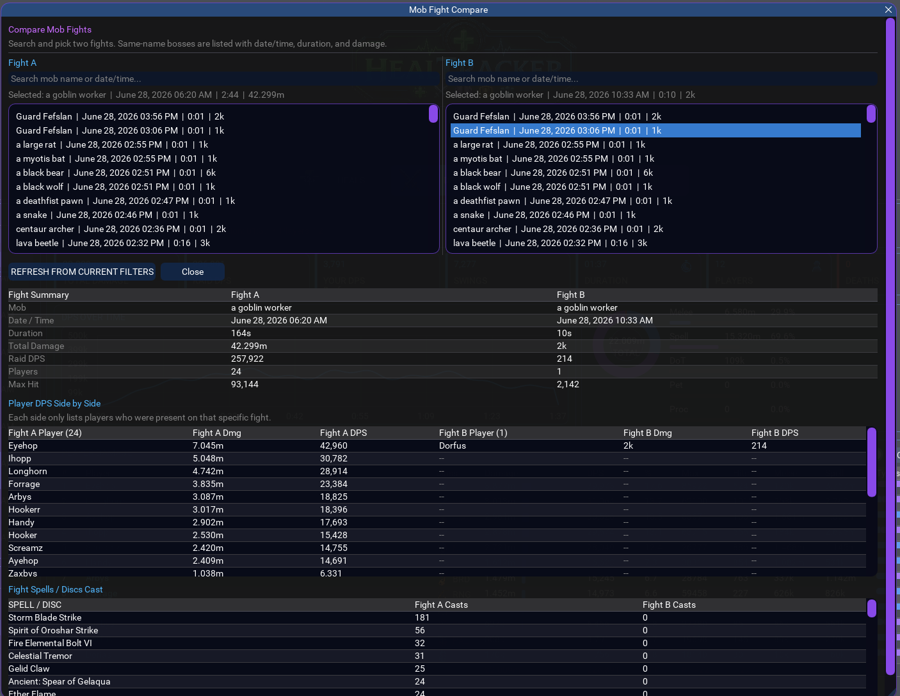

---

# Player DPS Comparison

Compare any two players directly.

Compare:

- Total damage
- DPS
- Hits
- Max hit
- Melee damage
- Spell damage
- DoT damage
- Proc damage
- Spell/Disc casts

Perfect for class optimization and burn analysis.

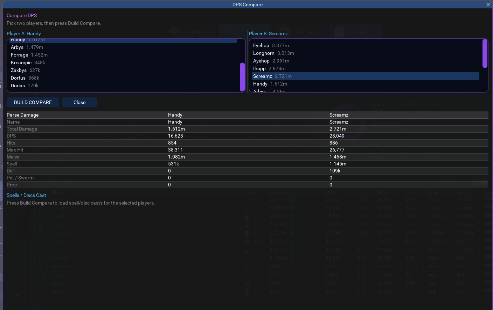

---

# Tank Analysis

HealTracker tracks incoming damage on tanks during every encounter.

### Features

- Damage taken
- Tank DTPS
- Avoidance
- Misses
- Dodges
- Parries
- Incoming hit counts
- Tank spike damage

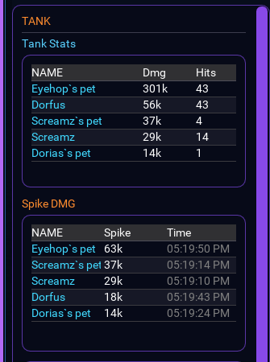

---

# Death Tracking

Track player deaths during encounters.

### Features

- Death timestamps
- Killer identification
- Spike damage before death
- Full death history

Click **View All Deaths** to review every death recorded during the encounter.

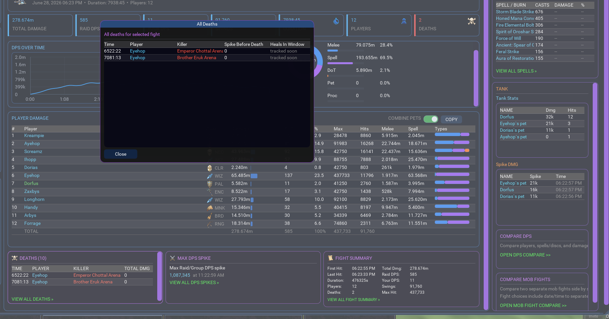

---

# DPS Spike Analysis

Identify exactly when raid damage spikes occurred.

### Features

- Raid spike detection
- Timestamped DPS spikes
- Hits within spike windows
- Drill-down analysis

Great for identifying burn phases and raid coordination.

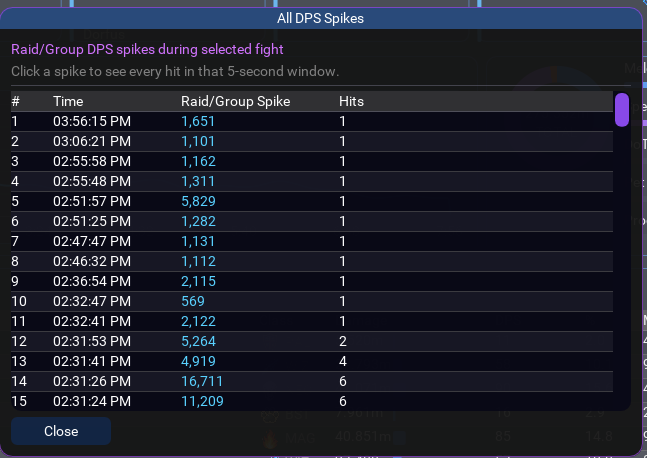

---

# Full Encounter Logs

HealTracker stores encounter logs which can later be searched.

Search logs to locate:

- Damage events
- Misses
- Spell casts
- Proc messages
- Death messages

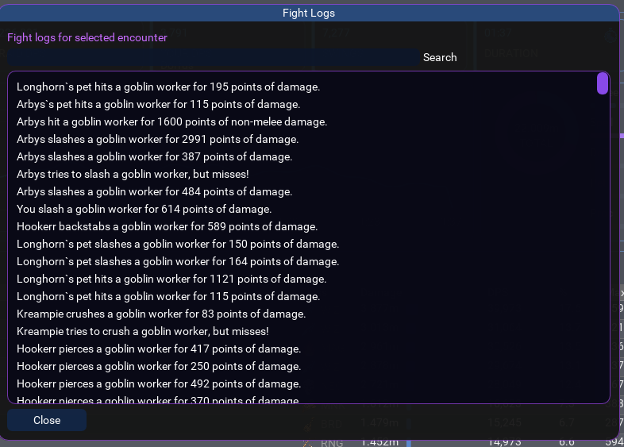

---

# Burn Timer System

HealTracker includes a fully customizable burn timer system.

Timers may be started:

- Manually
- From MQ2 Window text triggers
- Using predefined spell names

### Features

- Multiple simultaneous timers
- Custom display names
- Custom durations
- Test timers
- Enable/Disable timers
- Automatic mini overlay integration

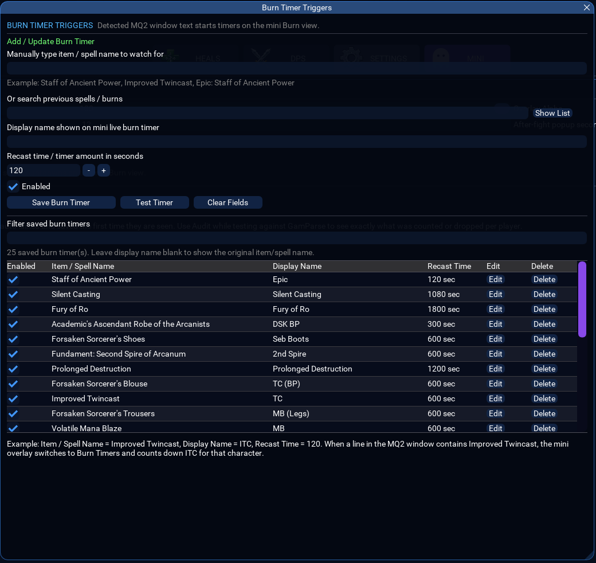

---

# Linked Pet Management

HealTracker automatically links pet damage to owners.

### Supported

- Standard pets
- Swarm pets
- Charmed pets
- Manually assigned pets

### Features

- Automatic pet ownership detection
- Manual overrides
- Persistent saved links
- Edit/Delete links

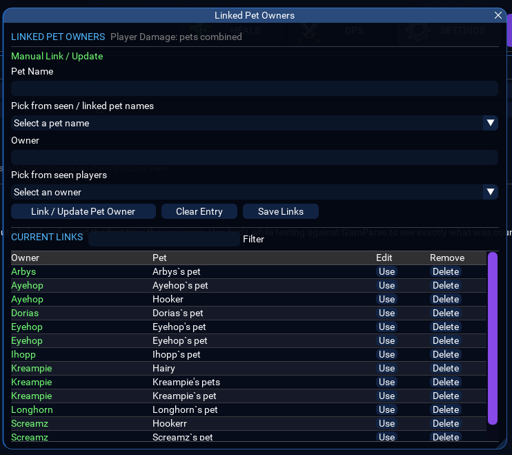

---

# Mini Overlay Windows

HealTracker includes lightweight overlays for live combat monitoring.

## DPS Overlay

Displays live raid DPS rankings.

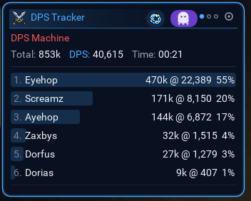

---

## Healing Overlay

Displays live healer performance.

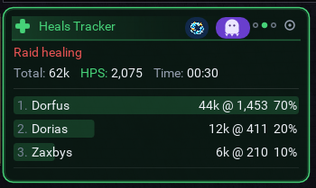

---

## Burn Overlay

Automatically appears whenever active burn timers are running.

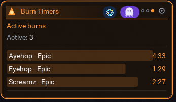

---

# UI Settings

Customize the plugin directly in game.

Options include:

- Overlay transparency
- After-fight popup duration
- Full UI enable/disable
- Mini overlay enable/disable
- Burn timer configuration
- Linked pet management

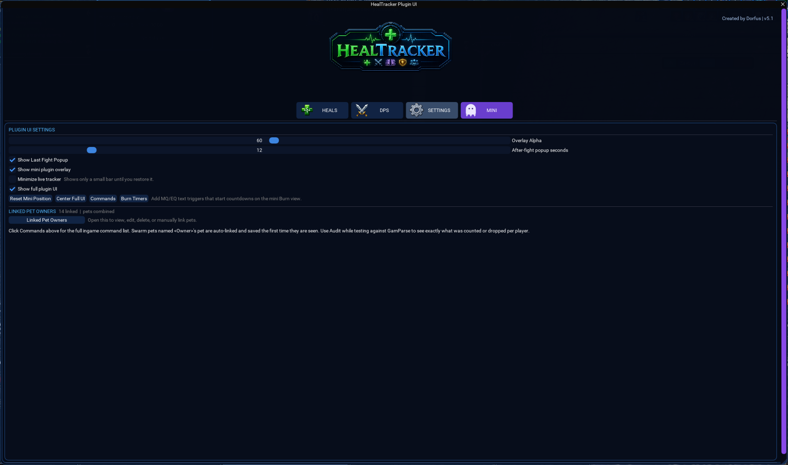

---

# Major Features Summary

✅ Live DPS Tracking  
✅ Live Healing Tracking  
✅ Historical Fight Database  
✅ Multi-Fight Combining  
✅ Encounter Comparison  
✅ Player Comparison  
✅ Burn Timers  
✅ Tank Analysis  
✅ Death Analysis  
✅ DPS Spike Detection  
✅ Pet Ownership Tracking  
✅ Rune Tracking  
✅ Spell Usage Analysis  
✅ Searchable Combat Logs  
✅ Real-Time Overlays  
✅ Export Functions  
✅ Fully Integrated EverQuest UI  

---

# Designed For

- Solo players
- Group players
- Raid leaders
- Class leaders
- Theorycrafters
- Min-max players
- Full raid environments

---

# Credits

## HealTracker

Created by **Dorfus**

Special thanks to the MacroQuest community for their continued support and testing.
